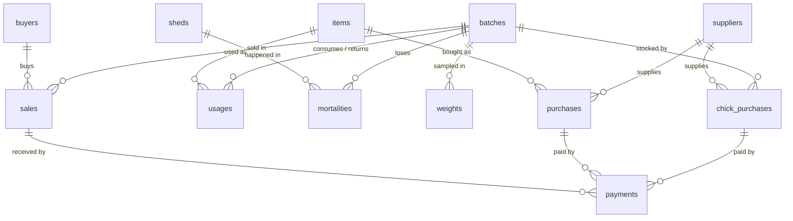

# Data Model — Sonali Batch Audit (temporary, pre-FMS)

Temporary system for recording batch data on **one farm** (5 sheds: 2 brooder, 3 grower) until the main FMS is live.
Stack: **Supabase (Postgres 15+)** for data, **Vite + React** web UI (see `prd.md`, `features.md`, `design.md`).

Goal of the model: capture every batch's chicks, inputs used, deaths, weights, sales and payments cleanly enough that
(a) the app can show batch cost, margin, mortality, FCR and dues, and (b) the data can be migrated into the FMS later.

---

## 1. Overview



| Table | Kind | What one row is |
|---|---|---|
| `sheds` | master | A shed (brooder or grower) |
| `items` | master | Something bought into the store: a feed, medicine, vaccine or husk |
| `suppliers` | master | Who we buy from (chicks and items) |
| `buyers` | master | Who we sell birds to |
| `batches` | master | One flock, from placement to final sale |
| `chick_purchases` | bill | Chicks bought and placed into a batch |
| `purchases` | bill | Items bought into the store (not tied to a batch) |
| `sales` | bill | One sale / delivery of birds to a buyer |
| `payments` | ledger | Money paid to a supplier, or received from a buyer, against one bill |
| `usages` | ledger | Items **issued** from the store to a batch, or **returned** from a batch to the store |
| `mortalities` | ledger | Birds dead on a date, in a shed, for a reason |
| `weights` | ledger | A weekly weight sample |

### How money and birds flow

```
Chicks:   chick_purchases (batch_id) ─────────────────────────────► batch chick cost, chicks placed
Inputs:   purchases (store) ──► usages ISSUE (batch) ─────────────► batch feed/medicine/vaccine/husk cost
                       ◄────── usages RETURN (batch → store) ─────  (reduces batch cost, back into stock)
Birds:    chicks placed − mortalities − sales.total_birds ────────► live balance (must be 0 at close)
Revenue:  sales (net weight × rate − discount) ───────────────────► batch sales
Payments: payments against chick_purchases / purchases / sales ───► paid, due, status per bill (v_bills)
```

Batch **gross margin** = sales − (chick cost + net usage cost). Labour, electricity and transport are **not** in
this model yet, so gross margin is *not* net profit.

---

## 2. Conventions

| Rule | Why |
|---|---|
| PK `id bigint generated always as identity` on every table | Simple and stable |
| Master tables also have a human `code` (unique), e.g. `B-001`, `S1`, `FD-01`, `SUP-01`, `BUY-01` | Readable in the UI and stable for the FMS migration. **Never change a code once used.** |
| Money `numeric(12,2)`, Tk, no currency symbol | Exact arithmetic (never `float`) |
| Weights `numeric(10,3)` kg; sample average in grams | |
| Row-level totals (bill amounts, net weight, crates, avg weight, usage cost) are **generated columns** | They can't disagree with their inputs. The UI never sends them. |
| Paid / due / payment status are computed in **`v_bills`** from `payments` | One source of truth for money paid, with full history |
| Bills and ledgers have `is_void boolean default false` | **"Delete" in the app = void.** Hidden everywhere, restorable, history kept. |
| Masters have `is_active boolean default true` | **"Archive"** hides a master from dropdowns. Hard delete is allowed only if it was never used (FKs block it otherwise). |
| Every table has `note text` and `created_at timestamptz default now()` | Audit trail |
| Feed bags are 50 kg (`items.unit_weight_kg = 50`) | Needed for FCR |
| A sales crate holds 20 kg; `crates = ceil(gross_weight_kg / 20)` | As agreed: computed, rounded up |

### Payment status (in `v_bills`)
| Condition | Status |
|---|---|
| paid ≥ amount | `PAID` |
| 0 < paid < amount | `PARTIALLY` |
| paid = 0 | `DUE` |

---

## 3. Tables

### 3.1 Masters

**`sheds`**: `id`, `code` (unique), `name`, `type shed_type` (`BROODER` / `GROWER`), `is_active`.

**`items`**: `id`, `code` (unique), `name`, `category item_category` (`FEED` / `MEDICINE` / `VACCINE` / `HUSK`),
`unit` (bag, bottle, vial, dose, pcs…), `unit_weight_kg` (**required for FEED**, 50), `is_active`.
Chicks are **not** items. They have their own table.

**`suppliers`** and **`buyers`**: `id`, `code` (unique), `name`, `company` (optional), `phone` (optional), `is_active`.

**`batches`**: `id`, `code` (unique), `start_date`, `close_date` (null = open, ≥ start_date), `status` (generated:
`OPEN` / `CLOSED`). Reopening a batch = clearing `close_date`.
Chicks placed and chick cost are **not stored here**. They come from `chick_purchases` (one-way link).

### 3.2 Bills

**`chick_purchases`**
| Column | Type | Rules |
|---|---|---|
| date | date | not null |
| batch_id | FK batches | a batch may have several deliveries |
| supplier_id | FK suppliers | |
| chicks_placed | integer | > 0 |
| rate | numeric(10,2) | > 0, Tk per chick |
| discount | numeric(12,2) | ≥ 0, ≤ total_price |
| total_price | **generated** | chicks_placed × rate |
| net_price | **generated** | total_price − discount = **bill amount** |

**`purchases`** (into the store, no batch)
| Column | Type | Rules |
|---|---|---|
| date | date | not null |
| item_id | FK items | |
| supplier_id | FK suppliers | |
| qty | numeric(12,3) | > 0, in the item's unit |
| unit_price | numeric(12,2) | ≥ 0 |
| amount | **generated** | qty × unit_price = **bill amount** |

**`sales`**
| Column | Type | Rules |
|---|---|---|
| date | date | not null |
| batch_id | FK batches | |
| buyer_id | FK buyers | |
| male_count, female_count | integer | ≥ 0, sum > 0 |
| grade | `sale_grade` | `A` / `B` / `C`. Mixed grades = one row per grade. |
| gross_weight_kg | numeric(10,3) | > 0, scale weight including crates |
| deduction_per_crate_g | numeric(8,2) | ≥ 0 |
| rate | numeric(10,2) | > 0, Tk per kg of **net** weight |
| discount | numeric(12,2) | ≥ 0 |
| total_birds | **generated** | male + female |
| crates | **generated** | ceil(gross ÷ 20) |
| deduction_kg | **generated** | crates × deduction_per_crate_g ÷ 1000 |
| net_weight_kg | **generated** | gross − deduction_kg (> 0) |
| amount | **generated** | net_weight_kg × rate − discount (≥ 0) = **bill amount** |

> Postgres generated columns can't reference each other, so the SQL repeats expressions on purpose.

### 3.3 `payments`
| Column | Type | Rules |
|---|---|---|
| date | date | not null |
| party | `party_type` | `SUPPLIER` / `BUYER` |
| chick_purchase_id / purchase_id / sale_id | FK | **exactly one** is set. BUYER ⇔ sale_id. |
| amount | numeric(12,2) | > 0 |
| method | `payment_method` | `CASH` / `BANK` / `MOBILE` |

Trigger `fn_payment_guard` rejects a payment that would make total paid exceed the bill amount.
One payment pays one bill. To pay a supplier for 3 bills, record 3 payments, so every bill's status stays exact.
"Paid now" on a bill form calls an RPC (`create_purchase`, `create_chick_purchase`, `create_sale`) that saves the
bill and its first payment together: both succeed or neither does.

### 3.4 `usages` (issue and return)
| Column | Type | Rules |
|---|---|---|
| date | date | not null |
| batch_id | FK batches | |
| item_id | FK items | |
| kind | `usage_kind` | `ISSUE` (store → batch, default) / `RETURN` (batch → store) |
| qty | numeric(12,3) | > 0, always positive (kind gives the direction) |
| unit_cost | numeric(12,4) | **set by trigger** |
| signed_qty | **generated** | +qty for ISSUE, −qty for RETURN |
| cost | **generated** | signed_qty × unit_cost (negative for a return) |

Trigger `fn_usage_unit_cost`:
- **ISSUE**: weighted-average purchase price of the item, from purchases on or before the date. Rejected if
  the item was never purchased. The cost is frozen, so later purchases don't change a closed batch.
- **RETURN**: the batch's own average issued cost for that item, so a return exactly reverses what was charged.
  Rejected if returning more than the batch's net issued quantity.

### 3.5 `mortalities`
`date`, `batch_id`, `shed_id`, `dead_count` (> 0), `reason mortality_reason` (`NORMAL` / `ACCIDENT` / `ILLNESS`).

### 3.6 `weights`
`date`, `batch_id`, `sample_size` (> 0, aim ≥ 50), `total_weight_kg` (> 0), `avg_weight_g` (generated).
Age at weighing = date − batch start (in the view, never typed).

---

## 4. Views (what the app reads)

All views use `security_invoker = true` (RLS applies) and ignore void rows.

| View | One row per | Used on |
|---|---|---|
| `v_bills` | bill (chicks / purchase / sale) | amount, paid, due, status, party, batch |
| `v_batch_summary` | batch | Home cards, Batches list, Batch detail |
| `v_batch_weights` | weight sample | Batch detail weight history (age, avg g, gain vs previous) |
| `v_item_stock` | item | Stock page |
| `v_supplier_balance` | supplier | Money page, Party detail |
| `v_buyer_balance` | buyer | Money page, Party detail |
| `v_reminders` | open problem in daily routine | Home |
| `v_data_checks` | data inconsistency | Home badge, Data checks page. **Should be empty.** |

`v_batch_summary` columns: code, status, start/close date, age_days, chicks_placed, dead, mortality_pct, birds_sold,
live_balance, net_kg_sold, avg_sale_weight_kg, latest_avg_weight_g, latest_weight_date, feed_bags, feed_kg, fcr,
chick_cost, feed_cost, medicine_cost, vaccine_cost, husk_cost, total_cost, sales_amount, gross_margin, cost_per_kg,
margin_per_chick, received, sales_due, last_usage_date.

Formulas:
- `mortality_pct = dead / chicks_placed`
- `live_balance = chicks_placed − dead − birds_sold`
- `feed_kg = Σ signed_qty × unit_weight_kg` (FEED)
- `fcr = feed_kg / net_kg_sold`. Meaningful only once birds are sold. While a batch is running, the app shows
  "FCR (est.)" = `feed_kg / (live_balance × latest_avg_weight_g / 1000 + net_kg_sold)`.
- `cost_per_kg = total_cost / net_kg_sold`
- `gross_margin = sales_amount − total_cost`

`v_reminders`:
1. Open batch with no usage recorded today or yesterday ("forgot to enter feed?")
2. Open batch ≥ 7 days old with no weight sample in the last 7 days

`v_data_checks`:
1. Closed batch whose live balance ≠ 0
2. Dead + sold > chicks placed
3. Batch with no chick purchase
4. Entry dated before batch start or after batch close
5. Item used more than purchased (negative stock)
6. Bill paid more than its amount (possible if a bill amount was edited down after payment)

---

## 5. Security (Supabase)

- RLS **enabled on every table**; one policy per table: authenticated users can do everything. `anon` gets nothing.
- Create one user in Supabase Auth, then **disable public sign-ups** (Authentication → Sign In / Providers → Email →
  turn off "Allow new users to sign up"). Otherwise anyone who finds the URL could register and read your finances.
- The frontend uses only the **publishable/anon key** plus the user's session. The `service_role` key and DB password
  must never be in the frontend, the repo or Vercel env vars for the frontend.

---

## 6. SQL (paste into the Supabase SQL editor, in order)

### 6.1 Types

```sql
create type shed_type        as enum ('BROODER', 'GROWER');
create type item_category    as enum ('FEED', 'MEDICINE', 'VACCINE', 'HUSK');
create type mortality_reason as enum ('NORMAL', 'ACCIDENT', 'ILLNESS');
create type sale_grade       as enum ('A', 'B', 'C');
create type usage_kind       as enum ('ISSUE', 'RETURN');
create type party_type       as enum ('SUPPLIER', 'BUYER');
create type payment_method   as enum ('CASH', 'BANK', 'MOBILE');
```

### 6.2 Master tables

```sql
create table sheds (
  id          bigint generated always as identity primary key,
  code        text not null unique,
  name        text not null,
  type        shed_type not null,
  is_active   boolean not null default true,
  note        text,
  created_at  timestamptz not null default now()
);

create table items (
  id              bigint generated always as identity primary key,
  code            text not null unique,
  name            text not null,
  category        item_category not null,
  unit            text not null,
  unit_weight_kg  numeric(8,3) check (unit_weight_kg > 0),
  is_active       boolean not null default true,
  note            text,
  created_at      timestamptz not null default now(),
  constraint items_feed_needs_weight check (category <> 'FEED' or unit_weight_kg is not null)
);

create table suppliers (
  id          bigint generated always as identity primary key,
  code        text not null unique,
  name        text not null,
  company     text,
  phone       text,
  is_active   boolean not null default true,
  note        text,
  created_at  timestamptz not null default now()
);

create table buyers (
  id          bigint generated always as identity primary key,
  code        text not null unique,
  name        text not null,
  company     text,
  phone       text,
  is_active   boolean not null default true,
  note        text,
  created_at  timestamptz not null default now()
);

create table batches (
  id          bigint generated always as identity primary key,
  code        text not null unique,
  start_date  date not null,
  close_date  date,
  status      text generated always as (case when close_date is null then 'OPEN' else 'CLOSED' end) stored,
  note        text,
  created_at  timestamptz not null default now(),
  constraint batches_dates check (close_date is null or close_date >= start_date)
);
```

### 6.3 Bills

```sql
create table chick_purchases (
  id             bigint generated always as identity primary key,
  date           date not null,
  batch_id       bigint not null references batches(id),
  supplier_id    bigint not null references suppliers(id),
  chicks_placed  integer not null check (chicks_placed > 0),
  rate           numeric(10,2) not null check (rate > 0),
  discount       numeric(12,2) not null default 0 check (discount >= 0),
  total_price    numeric(14,2) generated always as (chicks_placed * rate) stored,
  net_price      numeric(14,2) generated always as (chicks_placed * rate - discount) stored,
  is_void        boolean not null default false,
  note           text,
  created_at     timestamptz not null default now(),
  constraint chick_purchases_discount check (discount <= chicks_placed * rate)
);

create table purchases (
  id           bigint generated always as identity primary key,
  date         date not null,
  item_id      bigint not null references items(id),
  supplier_id  bigint not null references suppliers(id),
  qty          numeric(12,3) not null check (qty > 0),
  unit_price   numeric(12,2) not null check (unit_price >= 0),
  amount       numeric(14,2) generated always as (round(qty * unit_price, 2)) stored,
  is_void      boolean not null default false,
  note         text,
  created_at   timestamptz not null default now()
);

create table sales (
  id                     bigint generated always as identity primary key,
  date                   date not null,
  batch_id               bigint not null references batches(id),
  buyer_id               bigint not null references buyers(id),
  male_count             integer not null default 0 check (male_count >= 0),
  female_count           integer not null default 0 check (female_count >= 0),
  grade                  sale_grade not null,
  gross_weight_kg        numeric(10,3) not null check (gross_weight_kg > 0),
  deduction_per_crate_g  numeric(8,2) not null default 0 check (deduction_per_crate_g >= 0),
  rate                   numeric(10,2) not null check (rate > 0),
  discount               numeric(12,2) not null default 0 check (discount >= 0),
  -- generated (expressions repeated on purpose: generated columns can't reference each other)
  total_birds    integer generated always as (male_count + female_count) stored,
  crates         integer generated always as (ceil(gross_weight_kg / 20)::integer) stored,
  deduction_kg   numeric(10,3) generated always as (ceil(gross_weight_kg / 20) * deduction_per_crate_g / 1000) stored,
  net_weight_kg  numeric(10,3) generated always as (
                   gross_weight_kg - ceil(gross_weight_kg / 20) * deduction_per_crate_g / 1000) stored,
  amount         numeric(14,2) generated always as (round(
                   (gross_weight_kg - ceil(gross_weight_kg / 20) * deduction_per_crate_g / 1000) * rate - discount, 2)) stored,
  is_void        boolean not null default false,
  note           text,
  created_at     timestamptz not null default now(),
  constraint sales_birds  check (male_count + female_count > 0),
  constraint sales_net    check (gross_weight_kg - ceil(gross_weight_kg / 20) * deduction_per_crate_g / 1000 > 0),
  constraint sales_amount check ((gross_weight_kg - ceil(gross_weight_kg / 20) * deduction_per_crate_g / 1000) * rate - discount >= 0)
);
```

### 6.4 Payments and ledgers

```sql
create table payments (
  id                 bigint generated always as identity primary key,
  date               date not null,
  party              party_type not null,
  chick_purchase_id  bigint references chick_purchases(id),
  purchase_id        bigint references purchases(id),
  sale_id            bigint references sales(id),
  amount             numeric(12,2) not null check (amount > 0),
  method             payment_method not null default 'CASH',
  is_void            boolean not null default false,
  note               text,
  created_at         timestamptz not null default now(),
  constraint payments_one_bill check (num_nonnulls(chick_purchase_id, purchase_id, sale_id) = 1),
  constraint payments_party    check ((party = 'BUYER') = (sale_id is not null))
);

create table usages (
  id          bigint generated always as identity primary key,
  date        date not null,
  batch_id    bigint not null references batches(id),
  item_id     bigint not null references items(id),
  kind        usage_kind not null default 'ISSUE',
  qty         numeric(12,3) not null check (qty > 0),
  unit_cost   numeric(12,4) not null,          -- filled by trigger fn_usage_unit_cost
  signed_qty  numeric(12,3) generated always as (case when kind = 'RETURN' then -qty else qty end) stored,
  cost        numeric(14,2) generated always as (
                round(case when kind = 'RETURN' then -qty else qty end * unit_cost, 2)) stored,
  is_void     boolean not null default false,
  note        text,
  created_at  timestamptz not null default now()
);

create table mortalities (
  id          bigint generated always as identity primary key,
  date        date not null,
  batch_id    bigint not null references batches(id),
  shed_id     bigint not null references sheds(id),
  dead_count  integer not null check (dead_count > 0),
  reason      mortality_reason not null default 'NORMAL',
  is_void     boolean not null default false,
  note        text,
  created_at  timestamptz not null default now()
);

create table weights (
  id               bigint generated always as identity primary key,
  date             date not null,
  batch_id         bigint not null references batches(id),
  sample_size      integer not null check (sample_size > 0),
  total_weight_kg  numeric(10,3) not null check (total_weight_kg > 0),
  avg_weight_g     numeric(10,1) generated always as (round(total_weight_kg * 1000 / sample_size, 1)) stored,
  is_void          boolean not null default false,
  note             text,
  created_at       timestamptz not null default now()
);

-- FK indexes (Postgres doesn't create them automatically)
create index on chick_purchases (batch_id);
create index on chick_purchases (supplier_id);
create index on purchases (item_id);
create index on purchases (supplier_id);
create index on sales (batch_id);
create index on sales (buyer_id);
create index on payments (chick_purchase_id);
create index on payments (purchase_id);
create index on payments (sale_id);
create index on usages (batch_id, item_id);
create index on usages (item_id);
create index on mortalities (batch_id);
create index on weights (batch_id);
```

### 6.5 Triggers

```sql
-- Usage unit cost: ISSUE = store average price; RETURN = batch's average issued cost.
create or replace function fn_usage_unit_cost()
returns trigger
language plpgsql
as $$
declare
  v_cost      numeric;
  v_net_qty   numeric;
begin
  if new.kind = 'ISSUE' then
    select sum(p.amount) / nullif(sum(p.qty), 0)
      into v_cost
      from purchases p
     where p.item_id = new.item_id and p.date <= new.date and not p.is_void;

    if v_cost is null then
      raise exception 'No purchase of this item on or before %. Record the purchase first.', new.date
        using errcode = 'P0001', hint = 'usage_no_purchase';
    end if;
  else
    select sum(u.cost) filter (where u.kind = 'ISSUE') / nullif(sum(u.qty) filter (where u.kind = 'ISSUE'), 0),
           coalesce(sum(u.signed_qty), 0)
      into v_cost, v_net_qty
      from usages u
     where u.batch_id = new.batch_id and u.item_id = new.item_id and not u.is_void
       and u.id is distinct from new.id;

    if v_cost is null then
      raise exception 'This item was never issued to this batch, so it cannot be returned.'
        using errcode = 'P0001', hint = 'usage_return_not_issued';
    end if;
    if not new.is_void and new.qty > v_net_qty then
      raise exception 'Cannot return % — only % is still issued to this batch.', new.qty, v_net_qty
        using errcode = 'P0001', hint = 'usage_return_too_much';
    end if;
  end if;

  new.unit_cost := round(v_cost, 4);
  return new;
end;
$$;

create trigger trg_usage_unit_cost
before insert or update of item_id, batch_id, date, kind, qty on usages
for each row execute function fn_usage_unit_cost();

-- Payments may not exceed the bill amount.
create or replace function fn_payment_guard()
returns trigger
language plpgsql
as $$
declare
  v_bill  numeric;
  v_paid  numeric;
begin
  if new.is_void then
    return new;
  end if;

  if new.chick_purchase_id is not null then
    select net_price into v_bill from chick_purchases where id = new.chick_purchase_id and not is_void;
  elsif new.purchase_id is not null then
    select amount into v_bill from purchases where id = new.purchase_id and not is_void;
  else
    select amount into v_bill from sales where id = new.sale_id and not is_void;
  end if;

  if v_bill is null then
    raise exception 'The bill does not exist or was deleted.' using errcode = 'P0001', hint = 'payment_no_bill';
  end if;

  select coalesce(sum(amount), 0) into v_paid
    from payments
   where not is_void and id is distinct from new.id
     and chick_purchase_id is not distinct from new.chick_purchase_id
     and purchase_id       is not distinct from new.purchase_id
     and sale_id           is not distinct from new.sale_id;

  if v_paid + new.amount > v_bill then
    raise exception 'Payment % is more than the remaining due %.', new.amount, v_bill - v_paid
      using errcode = 'P0001', hint = 'payment_too_much';
  end if;

  return new;
end;
$$;

create trigger trg_payment_guard
before insert or update on payments
for each row execute function fn_payment_guard();
```

### 6.6 RPC: save a bill and its first payment together

```sql
create or replace function create_purchase(
  p_date date, p_item_id bigint, p_supplier_id bigint, p_qty numeric, p_unit_price numeric,
  p_paid numeric default 0, p_method payment_method default 'CASH', p_note text default null)
returns bigint
language plpgsql security invoker
as $$
declare v_id bigint;
begin
  insert into purchases (date, item_id, supplier_id, qty, unit_price, note)
  values (p_date, p_item_id, p_supplier_id, p_qty, p_unit_price, p_note)
  returning id into v_id;
  if coalesce(p_paid, 0) > 0 then
    insert into payments (date, party, purchase_id, amount, method)
    values (p_date, 'SUPPLIER', v_id, p_paid, p_method);
  end if;
  return v_id;
end;
$$;

create or replace function create_chick_purchase(
  p_date date, p_batch_id bigint, p_supplier_id bigint, p_chicks_placed integer, p_rate numeric,
  p_discount numeric default 0, p_paid numeric default 0, p_method payment_method default 'CASH',
  p_note text default null)
returns bigint
language plpgsql security invoker
as $$
declare v_id bigint;
begin
  insert into chick_purchases (date, batch_id, supplier_id, chicks_placed, rate, discount, note)
  values (p_date, p_batch_id, p_supplier_id, p_chicks_placed, p_rate, coalesce(p_discount, 0), p_note)
  returning id into v_id;
  if coalesce(p_paid, 0) > 0 then
    insert into payments (date, party, chick_purchase_id, amount, method)
    values (p_date, 'SUPPLIER', v_id, p_paid, p_method);
  end if;
  return v_id;
end;
$$;

create or replace function create_sale(
  p_date date, p_batch_id bigint, p_buyer_id bigint, p_male_count integer, p_female_count integer,
  p_grade sale_grade, p_gross_weight_kg numeric, p_deduction_per_crate_g numeric, p_rate numeric,
  p_discount numeric default 0, p_received numeric default 0, p_method payment_method default 'CASH',
  p_note text default null)
returns bigint
language plpgsql security invoker
as $$
declare v_id bigint;
begin
  insert into sales (date, batch_id, buyer_id, male_count, female_count, grade, gross_weight_kg,
                     deduction_per_crate_g, rate, discount, note)
  values (p_date, p_batch_id, p_buyer_id, coalesce(p_male_count, 0), coalesce(p_female_count, 0), p_grade,
          p_gross_weight_kg, coalesce(p_deduction_per_crate_g, 0), p_rate, coalesce(p_discount, 0), p_note)
  returning id into v_id;
  if coalesce(p_received, 0) > 0 then
    insert into payments (date, party, sale_id, amount, method)
    values (p_date, 'BUYER', v_id, p_received, p_method);
  end if;
  return v_id;
end;
$$;

revoke execute on function create_purchase, create_chick_purchase, create_sale from public, anon;
grant  execute on function create_purchase, create_chick_purchase, create_sale to authenticated;
```

### 6.7 Views

```sql
create or replace view v_bills with (security_invoker = true) as
with paid as (
  select chick_purchase_id, purchase_id, sale_id, sum(amount) as paid, max(date) as last_payment_date
  from payments where not is_void
  group by chick_purchase_id, purchase_id, sale_id
), bills as (
  select 'CHICKS'::text as bill_type, c.id as bill_id, c.date, 'SUPPLIER'::party_type as party,
         c.supplier_id as party_id, c.batch_id,
         c.chicks_placed || ' chicks' as description, c.net_price as amount
  from chick_purchases c where not c.is_void
  union all
  select 'PURCHASE', p.id, p.date, 'SUPPLIER', p.supplier_id, null,
         i.name || ' × ' || p.qty || ' ' || i.unit, p.amount
  from purchases p join items i on i.id = p.item_id where not p.is_void
  union all
  select 'SALE', s.id, s.date, 'BUYER', s.buyer_id, s.batch_id,
         s.total_birds || ' birds, ' || s.net_weight_kg || ' kg', s.amount
  from sales s where not s.is_void
)
select b.*,
       coalesce(pd.paid, 0)            as paid,
       b.amount - coalesce(pd.paid, 0) as due,
       case when coalesce(pd.paid, 0) >= b.amount then 'PAID'
            when coalesce(pd.paid, 0) > 0         then 'PARTIALLY'
            else 'DUE' end              as payment_status,
       pd.last_payment_date
from bills b
left join paid pd
  on (b.bill_type = 'CHICKS'   and pd.chick_purchase_id = b.bill_id)
  or (b.bill_type = 'PURCHASE' and pd.purchase_id       = b.bill_id)
  or (b.bill_type = 'SALE'     and pd.sale_id           = b.bill_id);

create or replace view v_batch_summary with (security_invoker = true) as
with chicks as (
  select batch_id, sum(chicks_placed) as chicks_placed, sum(net_price) as chick_cost
  from chick_purchases where not is_void group by batch_id
), dead as (
  select batch_id, sum(dead_count) as dead
  from mortalities where not is_void group by batch_id
), sold as (
  select batch_id, sum(total_birds) as birds_sold, sum(net_weight_kg) as net_kg_sold, sum(amount) as sales_amount
  from sales where not is_void group by batch_id
), money_in as (
  select batch_id, sum(paid) as received, sum(due) as sales_due
  from v_bills where bill_type = 'SALE' group by batch_id
), used as (
  select u.batch_id,
         sum(u.cost) filter (where i.category = 'FEED')     as feed_cost,
         sum(u.cost) filter (where i.category = 'MEDICINE') as medicine_cost,
         sum(u.cost) filter (where i.category = 'VACCINE')  as vaccine_cost,
         sum(u.cost) filter (where i.category = 'HUSK')     as husk_cost,
         sum(u.signed_qty) filter (where i.category = 'FEED') as feed_bags,
         sum(u.signed_qty * i.unit_weight_kg) filter (where i.category = 'FEED') as feed_kg,
         max(u.date) as last_usage_date
  from usages u join items i on i.id = u.item_id
  where not u.is_void group by u.batch_id
), last_weight as (
  select distinct on (batch_id) batch_id, avg_weight_g, date as latest_weight_date
  from weights where not is_void
  order by batch_id, date desc, id desc
), base as (
  select b.id, b.code, b.status, b.start_date, b.close_date, b.note,
         coalesce(b.close_date, current_date) - b.start_date as age_days,
         coalesce(c.chicks_placed, 0) as chicks_placed,
         coalesce(d.dead, 0)          as dead,
         coalesce(s.birds_sold, 0)    as birds_sold,
         coalesce(s.net_kg_sold, 0)   as net_kg_sold,
         lw.avg_weight_g              as latest_avg_weight_g,
         lw.latest_weight_date,
         coalesce(u.feed_bags, 0)     as feed_bags,
         coalesce(u.feed_kg, 0)       as feed_kg,
         coalesce(c.chick_cost, 0)    as chick_cost,
         coalesce(u.feed_cost, 0)     as feed_cost,
         coalesce(u.medicine_cost, 0) as medicine_cost,
         coalesce(u.vaccine_cost, 0)  as vaccine_cost,
         coalesce(u.husk_cost, 0)     as husk_cost,
         coalesce(s.sales_amount, 0)  as sales_amount,
         coalesce(m.received, 0)      as received,
         coalesce(m.sales_due, 0)     as sales_due,
         u.last_usage_date
  from batches b
  left join chicks c       on c.batch_id = b.id
  left join dead d         on d.batch_id = b.id
  left join sold s         on s.batch_id = b.id
  left join money_in m     on m.batch_id = b.id
  left join used u         on u.batch_id = b.id
  left join last_weight lw on lw.batch_id = b.id
)
select id, code, status, start_date, close_date, note, age_days,
       chicks_placed, dead,
       round(dead::numeric / nullif(chicks_placed, 0), 4)            as mortality_pct,
       birds_sold,
       chicks_placed - dead - birds_sold                             as live_balance,
       net_kg_sold,
       round(net_kg_sold / nullif(birds_sold, 0), 3)                 as avg_sale_weight_kg,
       latest_avg_weight_g, latest_weight_date,
       feed_bags, feed_kg,
       round(feed_kg / nullif(net_kg_sold, 0), 2)                    as fcr,
       round(feed_kg / nullif((chicks_placed - dead - birds_sold) * coalesce(latest_avg_weight_g, 0) / 1000
                              + net_kg_sold, 0), 2)                  as fcr_estimated,
       chick_cost, feed_cost, medicine_cost, vaccine_cost, husk_cost,
       chick_cost + feed_cost + medicine_cost + vaccine_cost + husk_cost as total_cost,
       sales_amount,
       sales_amount - (chick_cost + feed_cost + medicine_cost + vaccine_cost + husk_cost) as gross_margin,
       round((chick_cost + feed_cost + medicine_cost + vaccine_cost + husk_cost) / nullif(net_kg_sold, 0), 2) as cost_per_kg,
       round((sales_amount - (chick_cost + feed_cost + medicine_cost + vaccine_cost + husk_cost)) / nullif(chicks_placed, 0), 2) as margin_per_chick,
       received, sales_due, last_usage_date
from base;

create or replace view v_batch_weights with (security_invoker = true) as
select w.id, w.batch_id, w.date, w.date - b.start_date as age_days, (w.date - b.start_date) / 7 + 1 as age_week,
       w.sample_size, w.total_weight_kg, w.avg_weight_g,
       w.avg_weight_g - lag(w.avg_weight_g) over (partition by w.batch_id order by w.date, w.id) as gain_g,
       w.note
from weights w join batches b on b.id = w.batch_id
where not w.is_void;

create or replace view v_item_stock with (security_invoker = true) as
with p as (
  select item_id, sum(qty) as qty, sum(amount) as amount
  from purchases where not is_void group by item_id
), u as (
  select item_id,
         sum(qty) filter (where kind = 'ISSUE')  as issued,
         sum(qty) filter (where kind = 'RETURN') as returned
  from usages where not is_void group by item_id
)
select i.id, i.code, i.name, i.category, i.unit, i.is_active,
       coalesce(p.qty, 0)                                              as purchased_qty,
       coalesce(u.issued, 0)                                           as issued_qty,
       coalesce(u.returned, 0)                                         as returned_qty,
       coalesce(p.qty, 0) - coalesce(u.issued, 0) + coalesce(u.returned, 0) as balance_qty,
       round(p.amount / nullif(p.qty, 0), 2)                           as avg_unit_cost,
       round((coalesce(p.qty, 0) - coalesce(u.issued, 0) + coalesce(u.returned, 0))
             * coalesce(p.amount / nullif(p.qty, 0), 0), 2)            as stock_value
from items i
left join p on p.item_id = i.id
left join u on u.item_id = i.id;

create or replace view v_supplier_balance with (security_invoker = true) as
select s.id, s.code, s.name, s.company, s.phone, s.is_active,
       count(b.bill_id)             as bills,
       coalesce(sum(b.amount), 0)   as billed,
       coalesce(sum(b.paid), 0)     as paid,
       coalesce(sum(b.due), 0)      as due
from suppliers s
left join v_bills b on b.party = 'SUPPLIER' and b.party_id = s.id
group by s.id;

create or replace view v_buyer_balance with (security_invoker = true) as
select y.id, y.code, y.name, y.company, y.phone, y.is_active,
       count(b.bill_id)             as bills,
       coalesce(sum(b.amount), 0)   as billed,
       coalesce(sum(b.paid), 0)     as received,
       coalesce(sum(b.due), 0)      as due
from buyers y
left join v_bills b on b.party = 'BUYER' and b.party_id = y.id
group by y.id;

create or replace view v_reminders with (security_invoker = true) as
  select 'NO_USAGE' as kind, id as batch_id, code as batch_code,
         'No feed/usage entered since ' || coalesce(last_usage_date::text, 'start') as message
  from v_batch_summary
  where status = 'OPEN' and start_date < current_date
    and (last_usage_date is null or last_usage_date < current_date - 1)
union all
  select 'NO_WEIGHT', id, code,
         'No weight sample since ' || coalesce(latest_weight_date::text, 'start')
  from v_batch_summary
  where status = 'OPEN' and age_days >= 7
    and (latest_weight_date is null or latest_weight_date < current_date - 7);

create or replace view v_data_checks with (security_invoker = true) as
  select 'Closed batch: live balance not 0' as check_name, 'batches' as ref_table, id as ref_id, code as ref_code,
         'live_balance = ' || live_balance as detail
  from v_batch_summary where status = 'CLOSED' and live_balance <> 0
union all
  select 'Dead + sold exceeds chicks placed', 'batches', id, code, 'live_balance = ' || live_balance
  from v_batch_summary where live_balance < 0
union all
  select 'Batch has no chick purchase', 'batches', b.id, b.code, null
  from batches b
  where not exists (select 1 from chick_purchases c where c.batch_id = b.id and not c.is_void)
union all
  select 'Entry dated outside batch', t.ref_table, t.id, b.code, t.date::text
  from (
    select 'usages' as ref_table, id, batch_id, date from usages      where not is_void
    union all select 'mortalities', id, batch_id, date from mortalities where not is_void
    union all select 'weights',     id, batch_id, date from weights     where not is_void
    union all select 'sales',       id, batch_id, date from sales       where not is_void
    union all select 'chick_purchases', id, batch_id, date from chick_purchases where not is_void
  ) t
  join batches b on b.id = t.batch_id
  where t.date < b.start_date or (b.close_date is not null and t.date > b.close_date)
union all
  select 'Item used more than purchased', 'items', id, code, 'balance_qty = ' || balance_qty
  from v_item_stock where balance_qty < 0
union all
  select 'Bill paid more than its amount', lower(bill_type), bill_id, null, 'due = ' || due
  from v_bills where due < 0;
```

### 6.8 Row Level Security

```sql
do $$
declare t text;
begin
  foreach t in array array['sheds','items','suppliers','buyers','batches','chick_purchases','purchases',
                           'sales','payments','usages','mortalities','weights']
  loop
    execute format('alter table %I enable row level security', t);
    execute format('create policy %I on %I for all to authenticated using (true) with check (true)',
                   t || '_authenticated_all', t);
  end loop;
end $$;
```

### 6.9 Seed (your real sheds)

```sql
insert into sheds (code, name, type) values
  ('S1', 'Brooder 1', 'BROODER'),
  ('S2', 'Brooder 2', 'BROODER'),
  ('S3', 'Grower 1',  'GROWER'),
  ('S4', 'Grower 2',  'GROWER'),
  ('S5', 'Grower 3',  'GROWER');
```

---

## 7. Rules for the web UI

- **Never send generated columns or trigger-filled columns** (`total_price`, `net_price`, `amount`, `crates`,
  `deduction_kg`, `net_weight_kg`, `total_birds`, `avg_weight_g`, `status`, `unit_cost`, `signed_qty`, `cost`).
- New bills with a "paid now" amount go through the RPCs (`create_purchase`, `create_chick_purchase`, `create_sale`).
  Editing a bill is a normal `update`. Payments are added and edited in `payments`.
- Delete on bills/ledgers = `update … set is_void = true`. Restore = `is_void = false`. Voiding a bill does **not**
  void its payments automatically: the app voids them in the same action and says so.
- Masters: "Delete" tries a hard delete; if Postgres answers with a foreign-key error (`23503`), offer "Archive" instead.
- Trigger errors carry a `hint` (`usage_no_purchase`, `usage_return_not_issued`, `usage_return_too_much`,
  `payment_no_bill`, `payment_too_much`) that the UI maps to plain messages.

## 8. Not in v1 (deliberately)

| Left out | How to add later without breaking anything |
|---|---|
| Labour / payroll | `employees` + `payroll`; allocate to batches in a view by bird-days |
| Electricity, transport, repairs | `expenses(date, type, amount, batch_id null)` |
| Shed transfers (brooder → grower) | `batch_sheds(batch_id, shed_id, from_date, to_date)` |
| Physical stock counts / store losses | `stock_adjustments(date, item_id, qty, reason)`; include in `v_item_stock` |
| Transfers between batches | Today: RETURN from batch A + ISSUE to batch B |

## 9. Notes for the FMS migration

- Codes (`B-001`, `SUP-01`…) are the stable keys. Don't reuse or rename them.
- Void rows stay in the data, so the FMS gets the full history.
- Generated columns and views can be recomputed. Only input columns + `usages.unit_cost` (a frozen snapshot) need migrating.
