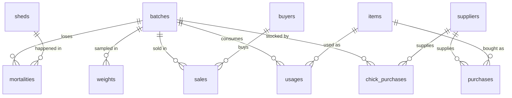

# Data Model — Sonali Batch Audit (temporary, pre-FMS)

Temporary system for recording batch data on **one farm** (5 sheds: 2 brooder, 3 grower) until the main FMS is live.
Stack: **Supabase (Postgres 15+)** for data, **Vite** web UI for data entry and a plain dashboard.

Goal of the model: capture every batch's chicks, inputs used, deaths, weights and sales cleanly enough that
(a) the dashboard can show batch cost, margin, mortality and FCR, and (b) the data can be migrated into the FMS later.

---

## 1. Overview



| Table | Kind | What one row is |
|---|---|---|
| `sheds` | master | A shed (brooder or grower) |
| `items` | master | Something bought into the store: a feed, medicine, vaccine or husk |
| `suppliers` | master | Who we buy from (chicks and items) |
| `buyers` | master | Who we sell birds to |
| `batches` | master | One flock, from placement to final sale |
| `chick_purchases` | ledger | Chicks bought and placed into a batch |
| `purchases` | ledger | Items bought into the store (not tied to a batch) |
| `usages` | ledger | Items taken from the store and used on a batch |
| `mortalities` | ledger | Birds dead on a date, in a shed, for a reason |
| `weights` | ledger | A weekly weight sample |
| `sales` | ledger | One sale / delivery of birds to a buyer |

### How money and birds flow

```
Chicks:  chick_purchases (batch_id) ───────────────────────────► batch chick cost, chicks placed
Inputs:  purchases (store, no batch) ──► usages (batch_id) ────► batch feed/medicine/vaccine/husk cost
Birds:   chicks placed − mortalities − sales.total_birds ──────► live balance (must be 0 at close)
Revenue: sales (net weight × rate − discount) ─────────────────► batch sales, buyer dues
```

Batch **gross margin** = sales − (chick cost + usage cost). Labour, electricity and transport are **not** in this
model yet, so gross margin is *not* net profit. Don't read it as "this batch made X Tk".

---

## 2. Conventions

| Rule | Why |
|---|---|
| PK `id bigint generated always as identity` on every table | Simple, fast and stable |
| Master tables also have a human `code` (unique), e.g. `B-001`, `S1`, `FD-01`, `SUP-01`, `BUY-01` | Readable in the UI and stable across the FMS migration. **Never change a code once used.** |
| Money `numeric(12,2)`, Tk, no currency symbol | Exact arithmetic (never `float`) |
| Weights `numeric(10,3)` kg; sample average in grams | Avoids 0.85 vs 850 typing errors |
| Totals, dues, payment status, net weight, avg weight are **generated columns** | They can never disagree with the numbers they're computed from. The UI never sends them. |
| Ledgers have `is_void boolean default false` | **Never delete** a ledger row: set `is_void = true` and write the reason in `note`. Every view ignores void rows. |
| Every table has `note text` and `created_at timestamptz default now()` | Audit trail |
| A date column is named `date` | Matches the paper records |
| Feed bags are 50 kg (`items.unit_weight_kg = 50`) | Needed to turn bags into kg for FCR |
| A sales crate holds 20 kg; `crates = ceil(gross_weight_kg / 20)` | As agreed: computed and rounded up, never typed |

### Payment status (generated, never typed)

| Condition | Status |
|---|---|
| paid/received ≥ amount | `PAID` |
| 0 < paid/received < amount | `PARTIALLY` |
| paid/received = 0 | `DUE` |

---

## 3. Tables

### 3.1 `sheds`
| Column | Type | Rules | Notes |
|---|---|---|---|
| id | bigint | PK | |
| code | text | unique, not null | `S1`…`S5` |
| name | text | not null | e.g. "Brooder 1" |
| type | `shed_type` | not null | `BROODER` / `GROWER` |

### 3.2 `items`
| Column | Type | Rules | Notes |
|---|---|---|---|
| id | bigint | PK | |
| code | text | unique, not null | `FD-01`, `MED-01`… |
| name | text | not null | "Grower feed (Brand X)" |
| category | `item_category` | not null | `FEED` / `MEDICINE` / `VACCINE` / `HUSK` |
| unit | text | not null | `bag`, `bottle`, `vial`, `dose`, `pcs`… |
| unit_weight_kg | numeric(8,3) | **required when FEED** | 50 for feed bags; null for others |

Chicks are **not** items. They have their own table (`chick_purchases`).

### 3.3 `suppliers` and `buyers` (same shape)
| Column | Type | Rules |
|---|---|---|
| id | bigint | PK |
| code | text | unique, not null |
| name | text | not null |
| company | text | optional |
| phone | text | optional |

### 3.4 `batches`
| Column | Type | Rules | Notes |
|---|---|---|---|
| id | bigint | PK | |
| code | text | unique, not null | `B-001` |
| start_date | date | not null | Placement date |
| close_date | date | null, ≥ start_date | Set when the last bird is sold or cleared |
| status | text | **generated** | `OPEN` if close_date is null, else `CLOSED` |

Chicks placed, chick cost and supplier are **not stored here**. They come from `chick_purchases`, which keeps the
link one-way and avoids two places that can disagree.

### 3.5 `chick_purchases`
| Column | Type | Rules | Notes |
|---|---|---|---|
| id | bigint | PK | |
| date | date | not null | |
| batch_id | bigint | FK → batches | A batch can have more than one delivery |
| supplier_id | bigint | FK → suppliers | |
| chicks_placed | integer | > 0 | |
| rate | numeric(10,2) | > 0 | Tk per chick |
| discount | numeric(12,2) | ≥ 0, ≤ total_price | |
| paid_amount | numeric(12,2) | ≥ 0, ≤ net_price | |
| total_price | numeric | **generated** | chicks_placed × rate |
| net_price | numeric | **generated** | total_price − discount |
| due_amount | numeric | **generated** | net_price − paid_amount |
| payment_status | text | **generated** | PAID / PARTIALLY / DUE |

### 3.6 `purchases` (store purchases — no batch)
| Column | Type | Rules | Notes |
|---|---|---|---|
| id | bigint | PK | |
| date | date | not null | |
| item_id | bigint | FK → items | |
| supplier_id | bigint | FK → suppliers | |
| qty | numeric(12,3) | > 0 | In the item's unit (bags for feed) |
| unit_price | numeric(12,2) | ≥ 0 | Tk per unit |
| paid_amount | numeric(12,2) | ≥ 0, ≤ amount | |
| amount | numeric | **generated** | qty × unit_price |
| due_amount | numeric | **generated** | amount − paid_amount |
| payment_status | text | **generated** | |

### 3.7 `usages` (store → batch)
| Column | Type | Rules | Notes |
|---|---|---|---|
| id | bigint | PK | |
| date | date | not null | |
| batch_id | bigint | FK → batches | |
| item_id | bigint | FK → items | |
| qty | numeric(12,3) | > 0 | In the item's unit |
| unit_cost | numeric(12,4) | **set by trigger** | Weighted-average purchase price of the item up to this date |
| cost | numeric | **generated** | qty × unit_cost |

**Why the unit cost isn't typed:** nobody remembers whether the last feed bags cost 3,050 or 3,120. The trigger
`fn_usage_unit_cost` freezes the average price *at the time of use*, so later purchases don't silently change the
cost of a batch that is already closed. If no purchase of that item exists on or before the usage date, the insert
is **rejected**: record the purchase first.

### 3.8 `mortalities`
| Column | Type | Rules | Notes |
|---|---|---|---|
| id | bigint | PK | |
| date | date | not null | |
| batch_id | bigint | FK → batches | |
| shed_id | bigint | FK → sheds | Where it happened |
| dead_count | integer | > 0 | |
| reason | `mortality_reason` | not null, default `NORMAL` | `NORMAL` / `ACCIDENT` / `ILLNESS` |

### 3.9 `weights`
| Column | Type | Rules | Notes |
|---|---|---|---|
| id | bigint | PK | |
| date | date | not null | |
| batch_id | bigint | FK → batches | |
| sample_size | integer | > 0 | Birds weighed. Aim for ≥ 50, spread across the shed. |
| total_weight_kg | numeric(10,3) | > 0 | Combined weight of the sample |
| avg_weight_g | numeric | **generated** | total_weight_kg × 1000 ÷ sample_size |

Age at weighing is calculated in the view (date − batch start_date). It is never typed.

### 3.10 `sales`
| Column | Type | Rules | Notes |
|---|---|---|---|
| id | bigint | PK | |
| date | date | not null | |
| batch_id | bigint | FK → batches | |
| buyer_id | bigint | FK → buyers | |
| male_count | integer | ≥ 0 | |
| female_count | integer | ≥ 0 | male + female > 0 |
| grade | `sale_grade` | not null | `A` / `B` / `C`. Mixed grades = one row per grade. |
| gross_weight_kg | numeric(10,3) | > 0 | Scale weight, including crates |
| deduction_per_crate_g | numeric(8,2) | ≥ 0 | Agreed deduction per crate |
| rate | numeric(10,2) | > 0 | Tk per kg of **net** weight |
| discount | numeric(12,2) | ≥ 0 | |
| received_amount | numeric(12,2) | ≥ 0, ≤ amount | |
| total_birds | integer | **generated** | male + female |
| crates | integer | **generated** | ceil(gross ÷ 20) |
| deduction_kg | numeric | **generated** | crates × deduction_per_crate_g ÷ 1000 |
| net_weight_kg | numeric | **generated** | gross − deduction_kg (must be > 0) |
| amount | numeric | **generated** | net_weight_kg × rate − discount (must be ≥ 0) |
| due_amount | numeric | **generated** | amount − received_amount |
| payment_status | text | **generated** | |

> Postgres generated columns can't reference other generated columns, so the SQL repeats the expressions.
> That's intentional. Don't "simplify" it.

---

## 4. Dashboard views

All views use `security_invoker = true` so RLS applies, and they ignore void rows.

| View | One row per | Columns |
|---|---|---|
| `v_batch_summary` | batch | code, status, start/close date, age_days, chicks_placed, dead, mortality_pct, birds_sold, live_balance, net_kg_sold, avg_sale_weight_kg, latest_avg_weight_g, feed_bags, feed_kg, fcr, chick_cost, feed_cost, medicine_cost, vaccine_cost, husk_cost, total_cost, sales_amount, gross_margin, cost_per_kg, margin_per_chick, received, sales_due |
| `v_item_stock` | item | purchased_qty, used_qty, balance_qty, avg_unit_cost, stock_value |
| `v_supplier_balance` | supplier | billed (chicks + items), paid, due |
| `v_buyer_balance` | buyer | birds, net_kg, billed, received, due |
| `v_data_checks` | problem found | check_name, ref_table, ref_id, ref_code, detail. **Should be empty.** |

Formulas:
- `mortality_pct = dead / chicks_placed`
- `live_balance = chicks_placed − dead − birds_sold`. On a closed batch it must be 0; anything else means birds are unaccounted for.
- `feed_kg = Σ usages.qty × items.unit_weight_kg` (FEED only)
- `fcr = feed_kg / net_kg_sold`. Only meaningful once the batch is sold.
- `cost_per_kg = total_cost / net_kg_sold`
- `gross_margin = sales_amount − total_cost`

`v_data_checks` flags:
1. Closed batch whose live balance ≠ 0
2. Batch whose dead + sold exceeds chicks placed (negative balance)
3. Batch with no chick purchase
4. Usage / mortality / weight / sale dated before the batch start or after its close
5. Item used more than purchased (negative stock)

---

## 5. Security (Supabase)

- RLS is **enabled on every table**.
- Single user: one policy per table, *authenticated users can do everything*. `anon` gets nothing.
- Create one user in Supabase Auth and turn off public sign-ups (Auth → Providers → Email → disable "Allow new users to sign up").
  Otherwise anyone who finds the URL could register and read or write your farm's finances.
- The Vite app uses only the **anon key** + the user's login session. Never put the `service_role` key in the frontend.

---

## 6. SQL (paste into the Supabase SQL editor, in order)

### 6.1 Types

```sql
create type shed_type        as enum ('BROODER', 'GROWER');
create type item_category    as enum ('FEED', 'MEDICINE', 'VACCINE', 'HUSK');
create type mortality_reason as enum ('NORMAL', 'ACCIDENT', 'ILLNESS');
create type sale_grade       as enum ('A', 'B', 'C');
```

### 6.2 Master tables

```sql
create table sheds (
  id          bigint generated always as identity primary key,
  code        text not null unique,
  name        text not null,
  type        shed_type not null,
  note        text,
  created_at  timestamptz not null default now()
);

create table items (
  id              bigint generated always as identity primary key,
  code            text not null unique,
  name            text not null,
  category        item_category not null,
  unit            text not null,
  unit_weight_kg  numeric(8,3) check (unit_weight_kg > 0),
  note            text,
  created_at      timestamptz not null default now(),
  constraint items_feed_needs_weight check (category <> 'FEED' or unit_weight_kg is not null)
);

create table suppliers (
  id          bigint generated always as identity primary key,
  code        text not null unique,
  name        text not null,
  company     text,
  phone       text,
  note        text,
  created_at  timestamptz not null default now()
);

create table buyers (
  id          bigint generated always as identity primary key,
  code        text not null unique,
  name        text not null,
  company     text,
  phone       text,
  note        text,
  created_at  timestamptz not null default now()
);

create table batches (
  id          bigint generated always as identity primary key,
  code        text not null unique,
  start_date  date not null,
  close_date  date,
  status      text generated always as (case when close_date is null then 'OPEN' else 'CLOSED' end) stored,
  note        text,
  created_at  timestamptz not null default now(),
  constraint batches_dates check (close_date is null or close_date >= start_date)
);
```

### 6.3 Ledger tables

```sql
create table chick_purchases (
  id              bigint generated always as identity primary key,
  date            date not null,
  batch_id        bigint not null references batches(id),
  supplier_id     bigint not null references suppliers(id),
  chicks_placed   integer not null check (chicks_placed > 0),
  rate            numeric(10,2) not null check (rate > 0),
  discount        numeric(12,2) not null default 0 check (discount >= 0),
  paid_amount     numeric(12,2) not null default 0 check (paid_amount >= 0),
  total_price     numeric(14,2) generated always as (chicks_placed * rate) stored,
  net_price       numeric(14,2) generated always as (chicks_placed * rate - discount) stored,
  due_amount      numeric(14,2) generated always as (chicks_placed * rate - discount - paid_amount) stored,
  payment_status  text generated always as (
                    case when paid_amount >= chicks_placed * rate - discount then 'PAID'
                         when paid_amount > 0 then 'PARTIALLY'
                         else 'DUE' end) stored,
  is_void         boolean not null default false,
  note            text,
  created_at      timestamptz not null default now(),
  constraint chick_purchases_discount check (discount <= chicks_placed * rate),
  constraint chick_purchases_paid     check (paid_amount <= chicks_placed * rate - discount)
);

create table purchases (
  id              bigint generated always as identity primary key,
  date            date not null,
  item_id         bigint not null references items(id),
  supplier_id     bigint not null references suppliers(id),
  qty             numeric(12,3) not null check (qty > 0),
  unit_price      numeric(12,2) not null check (unit_price >= 0),
  paid_amount     numeric(12,2) not null default 0 check (paid_amount >= 0),
  amount          numeric(14,2) generated always as (round(qty * unit_price, 2)) stored,
  due_amount      numeric(14,2) generated always as (round(qty * unit_price, 2) - paid_amount) stored,
  payment_status  text generated always as (
                    case when paid_amount >= round(qty * unit_price, 2) then 'PAID'
                         when paid_amount > 0 then 'PARTIALLY'
                         else 'DUE' end) stored,
  is_void         boolean not null default false,
  note            text,
  created_at      timestamptz not null default now(),
  constraint purchases_paid check (paid_amount <= round(qty * unit_price, 2))
);

create table usages (
  id          bigint generated always as identity primary key,
  date        date not null,
  batch_id    bigint not null references batches(id),
  item_id     bigint not null references items(id),
  qty         numeric(12,3) not null check (qty > 0),
  unit_cost   numeric(12,4) not null,          -- filled by trigger fn_usage_unit_cost
  cost        numeric(14,2) generated always as (round(qty * unit_cost, 2)) stored,
  is_void     boolean not null default false,
  note        text,
  created_at  timestamptz not null default now()
);

create table mortalities (
  id          bigint generated always as identity primary key,
  date        date not null,
  batch_id    bigint not null references batches(id),
  shed_id     bigint not null references sheds(id),
  dead_count  integer not null check (dead_count > 0),
  reason      mortality_reason not null default 'NORMAL',
  is_void     boolean not null default false,
  note        text,
  created_at  timestamptz not null default now()
);

create table weights (
  id               bigint generated always as identity primary key,
  date             date not null,
  batch_id         bigint not null references batches(id),
  sample_size      integer not null check (sample_size > 0),
  total_weight_kg  numeric(10,3) not null check (total_weight_kg > 0),
  avg_weight_g     numeric(10,1) generated always as (round(total_weight_kg * 1000 / sample_size, 1)) stored,
  is_void          boolean not null default false,
  note             text,
  created_at       timestamptz not null default now()
);

create table sales (
  id                     bigint generated always as identity primary key,
  date                   date not null,
  batch_id               bigint not null references batches(id),
  buyer_id               bigint not null references buyers(id),
  male_count             integer not null default 0 check (male_count >= 0),
  female_count           integer not null default 0 check (female_count >= 0),
  grade                  sale_grade not null,
  gross_weight_kg        numeric(10,3) not null check (gross_weight_kg > 0),
  deduction_per_crate_g  numeric(8,2) not null default 0 check (deduction_per_crate_g >= 0),
  rate                   numeric(10,2) not null check (rate > 0),
  discount               numeric(12,2) not null default 0 check (discount >= 0),
  received_amount        numeric(12,2) not null default 0 check (received_amount >= 0),
  -- generated (expressions repeated on purpose: generated columns can't reference each other)
  total_birds    integer generated always as (male_count + female_count) stored,
  crates         integer generated always as (ceil(gross_weight_kg / 20)::integer) stored,
  deduction_kg   numeric(10,3) generated always as (ceil(gross_weight_kg / 20) * deduction_per_crate_g / 1000) stored,
  net_weight_kg  numeric(10,3) generated always as (
                   gross_weight_kg - ceil(gross_weight_kg / 20) * deduction_per_crate_g / 1000) stored,
  amount         numeric(14,2) generated always as (round(
                   (gross_weight_kg - ceil(gross_weight_kg / 20) * deduction_per_crate_g / 1000) * rate - discount, 2)) stored,
  due_amount     numeric(14,2) generated always as (round(
                   (gross_weight_kg - ceil(gross_weight_kg / 20) * deduction_per_crate_g / 1000) * rate - discount, 2)
                   - received_amount) stored,
  payment_status text generated always as (
                   case when received_amount >= round((gross_weight_kg - ceil(gross_weight_kg / 20) * deduction_per_crate_g / 1000) * rate - discount, 2) then 'PAID'
                        when received_amount > 0 then 'PARTIALLY'
                        else 'DUE' end) stored,
  is_void        boolean not null default false,
  note           text,
  created_at     timestamptz not null default now(),
  constraint sales_birds    check (male_count + female_count > 0),
  constraint sales_net      check (gross_weight_kg - ceil(gross_weight_kg / 20) * deduction_per_crate_g / 1000 > 0),
  constraint sales_amount   check ((gross_weight_kg - ceil(gross_weight_kg / 20) * deduction_per_crate_g / 1000) * rate - discount >= 0),
  constraint sales_received check (received_amount <= round((gross_weight_kg - ceil(gross_weight_kg / 20) * deduction_per_crate_g / 1000) * rate - discount, 2))
);

-- FK indexes (Postgres doesn't create them automatically)
create index on chick_purchases (batch_id);
create index on chick_purchases (supplier_id);
create index on purchases (item_id);
create index on purchases (supplier_id);
create index on usages (batch_id);
create index on usages (item_id);
create index on mortalities (batch_id);
create index on weights (batch_id);
create index on sales (batch_id);
create index on sales (buyer_id);
```

### 6.4 Usage unit-cost trigger

```sql
create or replace function fn_usage_unit_cost()
returns trigger
language plpgsql
as $$
declare
  avg_cost numeric;
begin
  select sum(p.amount) / nullif(sum(p.qty), 0)
    into avg_cost
    from purchases p
   where p.item_id = new.item_id
     and p.date <= new.date
     and not p.is_void;

  if avg_cost is null then
    raise exception 'No purchase of item % on or before %. Record the purchase first.', new.item_id, new.date;
  end if;

  new.unit_cost := round(avg_cost, 4);
  return new;
end;
$$;

-- Recalculate on insert, and when the item or date of a usage is corrected.
create trigger trg_usage_unit_cost
before insert or update of item_id, date on usages
for each row execute function fn_usage_unit_cost();
```

### 6.5 Views

```sql
create or replace view v_batch_summary with (security_invoker = true) as
with chicks as (
  select batch_id, sum(chicks_placed) as chicks_placed, sum(net_price) as chick_cost
  from chick_purchases where not is_void group by batch_id
), dead as (
  select batch_id, sum(dead_count) as dead
  from mortalities where not is_void group by batch_id
), sold as (
  select batch_id,
         sum(total_birds)     as birds_sold,
         sum(net_weight_kg)   as net_kg_sold,
         sum(amount)          as sales_amount,
         sum(received_amount) as received,
         sum(due_amount)      as sales_due
  from sales where not is_void group by batch_id
), used as (
  select u.batch_id,
         sum(u.cost) filter (where i.category = 'FEED')     as feed_cost,
         sum(u.cost) filter (where i.category = 'MEDICINE') as medicine_cost,
         sum(u.cost) filter (where i.category = 'VACCINE')  as vaccine_cost,
         sum(u.cost) filter (where i.category = 'HUSK')     as husk_cost,
         sum(u.qty)  filter (where i.category = 'FEED')     as feed_bags,
         sum(u.qty * i.unit_weight_kg) filter (where i.category = 'FEED') as feed_kg
  from usages u join items i on i.id = u.item_id
  where not u.is_void group by u.batch_id
), last_weight as (
  select distinct on (batch_id) batch_id, avg_weight_g
  from weights where not is_void
  order by batch_id, date desc, id desc
), base as (
  select b.id, b.code, b.status, b.start_date, b.close_date,
         coalesce(b.close_date, current_date) - b.start_date as age_days,
         coalesce(c.chicks_placed, 0) as chicks_placed,
         coalesce(d.dead, 0)          as dead,
         coalesce(s.birds_sold, 0)    as birds_sold,
         coalesce(s.net_kg_sold, 0)   as net_kg_sold,
         lw.avg_weight_g              as latest_avg_weight_g,
         coalesce(u.feed_bags, 0)     as feed_bags,
         coalesce(u.feed_kg, 0)       as feed_kg,
         coalesce(c.chick_cost, 0)    as chick_cost,
         coalesce(u.feed_cost, 0)     as feed_cost,
         coalesce(u.medicine_cost, 0) as medicine_cost,
         coalesce(u.vaccine_cost, 0)  as vaccine_cost,
         coalesce(u.husk_cost, 0)     as husk_cost,
         coalesce(s.sales_amount, 0)  as sales_amount,
         coalesce(s.received, 0)      as received,
         coalesce(s.sales_due, 0)     as sales_due
  from batches b
  left join chicks c       on c.batch_id = b.id
  left join dead d         on d.batch_id = b.id
  left join sold s         on s.batch_id = b.id
  left join used u         on u.batch_id = b.id
  left join last_weight lw on lw.batch_id = b.id
)
select id, code, status, start_date, close_date, age_days,
       chicks_placed, dead,
       round(dead::numeric / nullif(chicks_placed, 0), 4)            as mortality_pct,
       birds_sold,
       chicks_placed - dead - birds_sold                             as live_balance,
       net_kg_sold,
       round(net_kg_sold / nullif(birds_sold, 0), 3)                 as avg_sale_weight_kg,
       latest_avg_weight_g,
       feed_bags, feed_kg,
       round(feed_kg / nullif(net_kg_sold, 0), 2)                    as fcr,
       chick_cost, feed_cost, medicine_cost, vaccine_cost, husk_cost,
       chick_cost + feed_cost + medicine_cost + vaccine_cost + husk_cost as total_cost,
       sales_amount,
       sales_amount - (chick_cost + feed_cost + medicine_cost + vaccine_cost + husk_cost) as gross_margin,
       round((chick_cost + feed_cost + medicine_cost + vaccine_cost + husk_cost) / nullif(net_kg_sold, 0), 2) as cost_per_kg,
       round((sales_amount - (chick_cost + feed_cost + medicine_cost + vaccine_cost + husk_cost)) / nullif(chicks_placed, 0), 2) as margin_per_chick,
       received, sales_due
from base;

create or replace view v_item_stock with (security_invoker = true) as
with p as (
  select item_id, sum(qty) as qty, sum(amount) as amount
  from purchases where not is_void group by item_id
), u as (
  select item_id, sum(qty) as qty, sum(cost) as cost
  from usages where not is_void group by item_id
)
select i.id, i.code, i.name, i.category, i.unit,
       coalesce(p.qty, 0)                                     as purchased_qty,
       coalesce(u.qty, 0)                                     as used_qty,
       coalesce(p.qty, 0) - coalesce(u.qty, 0)                as balance_qty,
       round(p.amount / nullif(p.qty, 0), 2)                  as avg_unit_cost,
       round((coalesce(p.qty, 0) - coalesce(u.qty, 0)) * coalesce(p.amount / nullif(p.qty, 0), 0), 2) as stock_value
from items i
left join p on p.item_id = i.id
left join u on u.item_id = i.id;

create or replace view v_supplier_balance with (security_invoker = true) as
with bills as (
  select supplier_id, net_price as billed, paid_amount as paid from chick_purchases where not is_void
  union all
  select supplier_id, amount, paid_amount from purchases where not is_void
)
select s.id, s.code, s.name, s.company, s.phone,
       coalesce(sum(b.billed), 0)                       as billed,
       coalesce(sum(b.paid), 0)                         as paid,
       coalesce(sum(b.billed), 0) - coalesce(sum(b.paid), 0) as due
from suppliers s
left join bills b on b.supplier_id = s.id
group by s.id;

create or replace view v_buyer_balance with (security_invoker = true) as
select b.id, b.code, b.name, b.company, b.phone,
       coalesce(sum(s.total_birds), 0)     as birds,
       coalesce(sum(s.net_weight_kg), 0)   as net_kg,
       coalesce(sum(s.amount), 0)          as billed,
       coalesce(sum(s.received_amount), 0) as received,
       coalesce(sum(s.due_amount), 0)      as due
from buyers b
left join sales s on s.buyer_id = b.id and not s.is_void
group by b.id;

create or replace view v_data_checks with (security_invoker = true) as
  select 'Closed batch: live balance not 0' as check_name, 'batches' as ref_table, id as ref_id, code as ref_code,
         'live_balance = ' || live_balance as detail
  from v_batch_summary where status = 'CLOSED' and live_balance <> 0
union all
  select 'Dead + sold exceeds chicks placed', 'batches', id, code, 'live_balance = ' || live_balance
  from v_batch_summary where live_balance < 0
union all
  select 'Batch has no chick purchase', 'batches', b.id, b.code, null
  from batches b
  where not exists (select 1 from chick_purchases c where c.batch_id = b.id and not c.is_void)
union all
  select 'Entry dated outside batch', t.ref_table, t.id, b.code, t.date::text
  from (
    select 'usages' as ref_table, id, batch_id, date from usages      where not is_void
    union all select 'mortalities', id, batch_id, date from mortalities where not is_void
    union all select 'weights',     id, batch_id, date from weights     where not is_void
    union all select 'sales',       id, batch_id, date from sales       where not is_void
    union all select 'chick_purchases', id, batch_id, date from chick_purchases where not is_void
  ) t
  join batches b on b.id = t.batch_id
  where t.date < b.start_date or (b.close_date is not null and t.date > b.close_date)
union all
  select 'Item used more than purchased', 'items', id, code, 'balance_qty = ' || balance_qty
  from v_item_stock where balance_qty < 0;
```

### 6.6 Row Level Security

```sql
do $$
declare t text;
begin
  foreach t in array array['sheds','items','suppliers','buyers','batches',
                           'chick_purchases','purchases','usages','mortalities','weights','sales']
  loop
    execute format('alter table %I enable row level security', t);
    execute format('create policy %I on %I for all to authenticated using (true) with check (true)',
                   t || '_authenticated_all', t);
  end loop;
end $$;
```

### 6.7 Seed (optional — your real sheds)

```sql
insert into sheds (code, name, type) values
  ('S1', 'Brooder 1', 'BROODER'),
  ('S2', 'Brooder 2', 'BROODER'),
  ('S3', 'Grower 1',  'GROWER'),
  ('S4', 'Grower 2',  'GROWER'),
  ('S5', 'Grower 3',  'GROWER');
```

---

## 7. Rules for the web UI

- **Never send generated columns** (`total_price`, `net_price`, `amount`, `due_amount`, `payment_status`, `crates`,
  `net_weight_kg`, `avg_weight_g`, `total_birds`, `status`, `unit_cost`, `cost`). Insert inputs only, then read the row back.
- Dropdowns show `code — name` but send `id`.
- "Delete" button = set `is_void = true` with a reason in `note`. No hard deletes on ledgers.
- Show `v_data_checks` on the dashboard home. It should be empty.
- Enter data the same day. The model can catch bad numbers, not missing ones.

## 8. Not in v1 (deliberately)

| Left out | How to add later without breaking anything |
|---|---|
| Labour / payroll | `employees` + `payroll(month, employee_id, amount…)`; allocate to batches in a view by bird-days |
| Electricity, transport, repairs | `expenses(date, type, amount, batch_id null)`; null batch = farm overhead |
| Shed transfers (brooder → grower) | `batch_sheds(batch_id, shed_id, from_date, to_date)` |
| Physical stock counts | `stock_counts(date, item_id, counted_qty)`; compare with `v_item_stock` |

Until labour and electricity exist, **gross margin overstates real profit.**

## 9. Notes for the FMS migration

- Codes (`B-001`, `SUP-01`…) are the stable keys to carry over. Don't reuse or rename them.
- Void rows stay in the data, so the FMS gets the full history, including corrections.
- Generated columns and views can be recomputed from the input columns. Only inputs need migrating.
- `usages.unit_cost` is a stored snapshot. Migrate it as-is so historic batch costs don't change.
