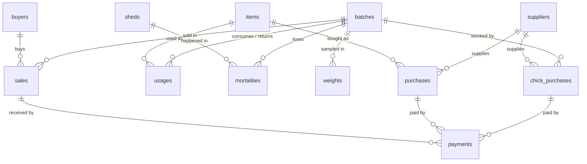

# Data Model — Sonali Batch Audit (temporary, pre-FMS)

Temporary system for recording batch data on **one farm** (5 sheds: 2 brooder, 3 grower) until the main FMS is live.
Stack: **Supabase (Postgres 15+)** for data, **Vite + React** web UI (see `prd.md`, `features.md`, `design.md`).

Goal of the model: capture every batch's chicks, inputs used, deaths, weights, sales and payments cleanly enough that
(a) the app can show batch cost, margin, mortality, FCR and dues, and (b) the data can be migrated into the FMS later.

---

## 1. Overview



| Table | Kind | What one row is |
|---|---|---|
| `sheds` | master | A shed (brooder or grower) |
| `items` | master | Something bought into the store: a feed, medicine, vaccine or husk |
| `suppliers` | master | Who we buy from (chicks and items) |
| `buyers` | master | Who we sell birds to |
| `batches` | master | One flock, from placement to final sale |
| `chick_purchases` | bill | Chicks bought and placed into a batch |
| `purchases` | bill | Items bought into the store (not tied to a batch) |
| `sales` | bill | One sale / delivery of birds to a buyer |
| `payments` | ledger | Money paid to a supplier, or received from a buyer, against one bill |
| `usages` | ledger | Items **issued** from the store to a batch, or **returned** from a batch to the store |
| `mortalities` | ledger | Birds dead on a date, in a shed, for a reason |
| `weights` | ledger | A weekly weight sample |

### How money and birds flow

```
Chicks:   chick_purchases (batch_id) ─────────────────────────────► batch chick cost, chicks placed
Inputs:   purchases (store) ──► usages ISSUE (batch) ─────────────► batch feed/medicine/vaccine/husk cost
                       ◄────── usages RETURN (batch → store) ─────  (reduces batch cost, back into stock)
Birds:    chicks placed − mortalities − sales.total_birds ────────► live balance (must be 0 at close)
Revenue:  sales (net weight × rate − discount) ───────────────────► batch sales
Payments: payments against chick_purchases / purchases / sales ───► paid, due, status per bill (v_bills)
```

Batch **gross margin** = sales − (chick cost + net usage cost). Labour, electricity and transport are **not** in
this model yet, so gross margin is *not* net profit.

---

## 2. Conventions

| Rule | Why |
|---|---|
| PK `id bigint generated always as identity` on every table | Simple and stable |
| Master tables also have a human `code` (unique), e.g. `B-001`, `S1`, `FD-01`, `SUP-01`, `BUY-01` | Readable in the UI and stable for the FMS migration. **Never change a code once used.** |
| Money `numeric(12,2)`, Tk, no currency symbol | Exact arithmetic (never `float`) |
| Weights `numeric(10,3)` kg; sample average in grams | |
| Row-level totals (bill amounts, net weight, crates, avg weight, usage cost) are **generated columns** | They can't disagree with their inputs. The UI never sends them. |
| Paid / due / payment status are computed in **`v_bills`** from `payments` | One source of truth for money paid, with full history |
| Bills and ledgers have `is_void boolean default false` | **"Delete" in the app = void.** Hidden everywhere, restorable, history kept. |
| Masters have `is_active boolean default true` | **"Archive"** hides a master from dropdowns. Hard delete is allowed only if it was never used (FKs block it otherwise). |
| Every table has `note text` and `created_at timestamptz default now()` | Audit trail |
| Feed bags are 50 kg (`items.unit_weight_kg = 50`) | Needed for FCR |
| A sales crate holds 20 kg; `crates = ceil(gross_weight_kg / 20)` | As agreed: computed, rounded up |

### Payment status (in `v_bills`)
| Condition | Status |
|---|---|
| paid ≥ amount | `PAID` |
| 0 < paid < amount | `PARTIALLY` |
| paid = 0 | `DUE` |

---

## 3. Tables

### 3.1 Masters

**`sheds`**: `id`, `code` (unique), `name`, `type shed_type` (`BROODER` / `GROWER`), `is_active`.

**`items`**: `id`, `code` (unique), `name`, `category item_category` (`FEED` / `MEDICINE` / `VACCINE` / `HUSK`),
`unit` (bag, bottle, vial, dose, pcs…), `unit_weight_kg` (**required for FEED**, 50), `is_active`.
Chicks are **not** items. They have their own table.

**`suppliers`** and **`buyers`**: `id`, `code` (unique), `name`, `company` (optional), `phone` (optional), `is_active`.

**`batches`**: `id`, `code` (unique), `start_date`, `close_date` (null = open, ≥ start_date), `status` (generated:
`OPEN` / `CLOSED`). Reopening a batch = clearing `close_date`.
Chicks placed and chick cost are **not stored here**. They come from `chick_purchases` (one-way link).

### 3.2 Bills

**`chick_purchases`**
| Column | Type | Rules |
|---|---|---|
| date | date | not null |
| batch_id | FK batches | a batch may have several deliveries |
| supplier_id | FK suppliers | |
| chicks_placed | integer | > 0 |
| rate | numeric(10,2) | > 0, Tk per chick |
| discount | numeric(12,2) | ≥ 0, ≤ total_price |
| total_price | **generated** | chicks_placed × rate |
| net_price | **generated** | total_price − discount = **bill amount** |

**`purchases`** (into the store, no batch)
| Column | Type | Rules |
|---|---|---|
| date | date | not null |
| item_id | FK items | |
| supplier_id | FK suppliers | |
| qty | numeric(12,3) | > 0, in the item's unit |
| unit_price | numeric(12,2) | ≥ 0 |
| amount | **generated** | qty × unit_price = **bill amount** |

**`sales`**
| Column | Type | Rules |
|---|---|---|
| date | date | not null |
| batch_id | FK batches | |
| buyer_id | FK buyers | |
| male_count, female_count | integer | ≥ 0, sum > 0 |
| grade | `sale_grade` | `A` / `B` / `C`. Mixed grades = one row per grade. |
| gross_weight_kg | numeric(10,3) | > 0, scale weight including crates |
| deduction_per_crate_g | numeric(8,2) | ≥ 0 |
| rate | numeric(10,2) | > 0, Tk per kg of **net** weight |
| discount | numeric(12,2) | ≥ 0 |
| total_birds | **generated** | male + female |
| crates | **generated** | ceil(gross ÷ 20) |
| deduction_kg | **generated** | crates × deduction_per_crate_g ÷ 1000 |
| net_weight_kg | **generated** | gross − deduction_kg (> 0) |
| amount | **generated** | net_weight_kg × rate − discount (≥ 0) = **bill amount** |

> Postgres generated columns can't reference each other, so the SQL repeats expressions on purpose.

### 3.3 `payments`
| Column | Type | Rules |
|---|---|---|
| date | date | not null |
| party | `party_type` | `SUPPLIER` / `BUYER` |
| chick_purchase_id / purchase_id / sale_id | FK | **exactly one** is set. BUYER ⇔ sale_id. |
| amount | numeric(12,2) | > 0 |
| method | `payment_method` | `CASH` / `BANK` / `MOBILE` |

Trigger `fn_payment_guard` rejects a payment that would make total paid exceed the bill amount.
One payment pays one bill. To pay a supplier for 3 bills, record 3 payments, so every bill's status stays exact.
"Paid now" on a bill form calls an RPC (`create_purchase`, `create_chick_purchase`, `create_sale`) that saves the
bill and its first payment together: both succeed or neither does.

### 3.4 `usages` (issue and return)
| Column | Type | Rules |
|---|---|---|
| date | date | not null |
| batch_id | FK batches | |
| item_id | FK items | |
| kind | `usage_kind` | `ISSUE` (store → batch, default) / `RETURN` (batch → store) |
| qty | numeric(12,3) | > 0, always positive (kind gives the direction) |
| unit_cost | numeric(12,4) | **set by trigger** |
| signed_qty | **generated** | +qty for ISSUE, −qty for RETURN |
| cost | **generated** | signed_qty × unit_cost (negative for a return) |

Trigger `fn_usage_unit_cost`:
- **ISSUE**: weighted-average purchase price of the item, from purchases on or before the date. Rejected if
  the item was never purchased. The cost is frozen, so later purchases don't change a closed batch.
- **RETURN**: the batch's own average issued cost for that item, so a return exactly reverses what was charged.
  Rejected if returning more than the batch's net issued quantity.

### 3.5 `mortalities`
`date`, `batch_id`, `shed_id`, `dead_count` (> 0), `reason mortality_reason` (`NORMAL` / `ACCIDENT` / `ILLNESS`).

### 3.6 `weights`
`date`, `batch_id`, `sample_size` (> 0, aim ≥ 50), `total_weight_kg` (> 0), `avg_weight_g` (generated).
Age at weighing = date − batch start (in the view, never typed).

---

## 4. Views (what the app reads)

All views use `security_invoker = true` (RLS applies) and ignore void rows.

| View | One row per | Used on |
|---|---|---|
| `v_bills` | bill (chicks / purchase / sale) | amount, paid, due, status, party, batch |
| `v_batch_summary` | batch | Home cards, Batches list, Batch detail |
| `v_batch_weights` | weight sample | Batch detail weight history (age, avg g, gain vs previous) |
| `v_item_stock` | item | Stock page |
| `v_supplier_balance` | supplier | Money page, Party detail |
| `v_buyer_balance` | buyer | Money page, Party detail |
| `v_reminders` | open problem in daily routine | Home |
| `v_data_checks` | data inconsistency | Home badge, Data checks page. **Should be empty.** |

`v_batch_summary` columns: code, status, start/close date, age_days, chicks_placed, dead, mortality_pct, birds_sold,
live_balance, net_kg_sold, avg_sale_weight_kg, latest_avg_weight_g, latest_weight_date, feed_bags, feed_kg, fcr,
chick_cost, feed_cost, medicine_cost, vaccine_cost, husk_cost, total_cost, sales_amount, gross_margin, cost_per_kg,
margin_per_chick, received, sales_due, last_usage_date.

Formulas:
- `mortality_pct = dead / chicks_placed`
- `live_balance = chicks_placed − dead − birds_sold`
- `feed_kg = Σ signed_qty × unit_weight_kg` (FEED)
- `fcr = feed_kg / net_kg_sold`. Meaningful only once birds are sold. While a batch is running, the app shows
  "FCR (est.)" = `feed_kg / (live_balance × latest_avg_weight_g / 1000 + net_kg_sold)`.
- `cost_per_kg = total_cost / net_kg_sold`
- `gross_margin = sales_amount − total_cost`

`v_reminders`:
1. Open batch with no usage recorded today or yesterday ("forgot to enter feed?")
2. Open batch ≥ 7 days old with no weight sample in the last 7 days

`v_data_checks`:
1. Closed batch whose live balance ≠ 0
2. Dead + sold > chicks placed
3. Batch with no chick purchase
4. Entry dated before batch start or after batch close
5. Item used more than purchased (negative stock)
6. Bill paid more than its amount (possible if a bill amount was edited down after payment)

---

## 5. Security (Supabase)

- RLS **enabled on every table**; one policy per table: authenticated users can do everything. `anon` gets nothing.
- Create one user in Supabase Auth, then **disable public sign-ups** (Authentication → Sign In / Providers → Email →
  turn off "Allow new users to sign up"). Otherwise anyone who finds the URL could register and read your finances.
- The frontend uses only the **publishable/anon key** plus the user's session. The `service_role` key and DB password
  must never be in the frontend, the repo or Vercel env vars for the frontend.

---

## 6. SQL

The SQL lives in files (single source of truth):

| File | What |
|---|---|
| `supabase/migrations/20261002000000_init.sql` | Types, tables, triggers, RPCs, views, RLS |
| `supabase/seed.sql` | Your 5 sheds |

**Apply to Supabase:** Dashboard → SQL Editor → New query → paste the migration file → Run. Then the same with
`seed.sql`. Run each once on an empty project.

---

## 7. Rules for the web UI

- **Never send generated columns or trigger-filled columns** (`total_price`, `net_price`, `amount`, `crates`,
  `deduction_kg`, `net_weight_kg`, `total_birds`, `avg_weight_g`, `status`, `unit_cost`, `signed_qty`, `cost`).
- New bills with a "paid now" amount go through the RPCs (`create_purchase`, `create_chick_purchase`, `create_sale`).
  Editing a bill is a normal `update`. Payments are added and edited in `payments`.
- Delete on bills/ledgers = `update … set is_void = true`. Restore = `is_void = false`. Voiding a bill does **not**
  void its payments automatically: the app voids them in the same action and says so.
- Masters: "Delete" tries a hard delete; if Postgres answers with a foreign-key error (`23503`), offer "Archive" instead.
- Trigger errors carry a `hint` (`usage_no_purchase`, `usage_return_not_issued`, `usage_return_too_much`,
  `payment_no_bill`, `payment_too_much`) that the UI maps to plain messages.

## 8. Not in v1 (deliberately)

| Left out | How to add later without breaking anything |
|---|---|
| Labour / payroll | `employees` + `payroll`; allocate to batches in a view by bird-days |
| Electricity, transport, repairs | `expenses(date, type, amount, batch_id null)` |
| Shed transfers (brooder → grower) | `batch_sheds(batch_id, shed_id, from_date, to_date)` |
| Physical stock counts / store losses | `stock_adjustments(date, item_id, qty, reason)`; include in `v_item_stock` |
| Transfers between batches | Today: RETURN from batch A + ISSUE to batch B |

## 9. Notes for the FMS migration

- Codes (`B-001`, `SUP-01`…) are the stable keys. Don't reuse or rename them.
- Void rows stay in the data, so the FMS gets the full history.
- Generated columns and views can be recomputed. Only input columns + `usages.unit_cost` (a frozen snapshot) need migrating.
